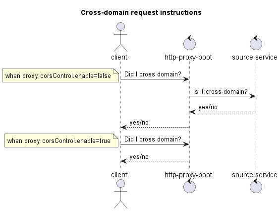

借鉴[开源HTTP-Proxy-Servlet](https://github.com/mitre/HTTP-Proxy-Servlet)使用vertx实现的开箱即用的Java HTTP反向代理工具，支持根据路径代理至不同路径

创建配置文件 `application.yml` 

```yaml
logging:
  config: classpath:log/logback.xml
  file:
    path: logs
server:
  port: 8080
  tomcat:
    threads:
      max: 5000
proxy:
  servlets:
    - name: bing
      servletUrl: /*
      targetUrl: https://cn.bing.com
    - name: jetbrains
      servletUrl: /test/*
      targetUrl: http://jetbrains.meethigher.top
```

启动

```sh
java -jar http-proxy-boot.jar --spring.config.location=application.yml
```

跨域参数说明




详细参数示例

```yml
logging:
  config: classpath:log/logback.xml
  file:
    path: logs
server:
  port: 8080
  tomcat:
    threads:
      max: 5000
proxy:
  servlets:
    - name: bing
      # /* represents all interfaces below proxy /, no distinction between /* and /**
      servletUrl: /*
      targetUrl: https://meethigher.top
      xForwardedFor: false
      preserveHost: false
      preserveCookies: true
      followRedirects: false
      log:
        enable: true
        # configure the agent’s log format. the options are remoteAddr、remotePort、userAgent、method、source、target、consumedMills
        logFormat: "{remoteAddr} {method} uri: {source} --> {target} consumed {consumedMills} ms"
      corsControl:
        # true means that the cors of all requests is managed by http-proxy-boot;
        # false means that the cors of all requests is managed by the source service.
        enable: false
        # true means that the cors of all requests is allowed when enable=true
        # false means that the cors of all requests is not allowed then enable=true
        allowCORS: true
```

